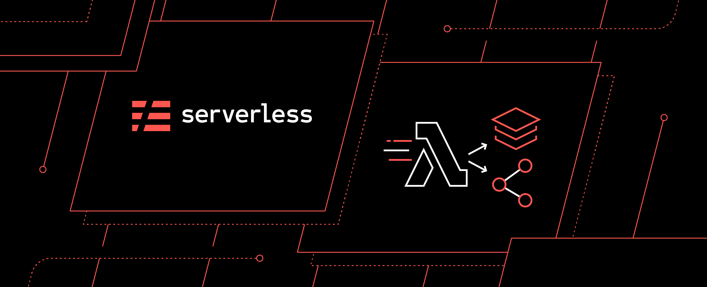

<h1 align="center">
    
</h1>

<h1 align="center">
   <a href="#"> Nodeless </a>
</h1>

<h3 align="center">
    It's just a project for study!
</h3>

<p align="center">
  

  
  
  <a href="https://github.com/zEduardofaria/nest-bookmark-api/commits/master">
    
  </a>
    
   
   <a href="https://github.com/zEduardofaria/nest-bookmark-api/stargazers">
    
  </a>
</p>

<h4 align="center"> 
	 Status: Finished
</h4>

<p align="center">
 <a href="#about">About</a> •
 <a href="#features">Features</a> •
 <a href="#tech-stack">Tech Stack</a> • 
 <a href="#user-content-license">License</a>

</p>

## About

It's a simple lambda function responsible for resize every image uploaded in my S3 bucket

---

## Features

- [x] Resize uploaded images in my bucket

---

### Pre-requisites

Before you begin, you will need to have the following tools installed on your machine:
[Git](https://git-scm.com), [Node.js](https://nodejs.org/en/), [Serverless](https://www.serverless.com/),
In addition, it is good to have an editor to work with the code like [VSCode](https://code.visualstudio.com/)

#### Running

```bash

# Clone this repository
$ git clone git@github.com:zEduardofaria/nodeless.git

# Access the project folder cmd/terminal
$ cd nodeless

# install the dependencies
$ yarn install

# Create an user in your AWS Account

# Add it's credentials in ~/.aws/credentials

# Add the profile created in credentials file in package.json "deploy" script.
# serverless deploy --verbose --aws-profile={profile-name}

# Go to serverless.yml and change eduardo-nodeless-bucket bucket name for the name you want to your own bucket
# bucket: {bucket-name}

# install the dependencies
$ yarn deploy

```

## Tech Stack

The following tools were used in the construction of the project:

#### **Server** ([NodeJS](https://nodejs.org/en/) + [TypeScript](https://www.typescriptlang.org/))

- **[Node](https://nodejs.org/)**
- **[Serverless](https://www.serverless.com/)**

> See the file [package.json](https://github.com/zEduardofaria/nodeless/blob/master/package.json)

#### **Utilitários**

- Editor: **[Visual Studio Code](https://code.visualstudio.com/)**

---

## License

This project is under the license [MIT](./LICENSE.md).

Made with love by Eduardo Faria 👋🏽 [Get in Touch!](Https://www.linkedin.com/in/eduardo-fariasilva/)

---
